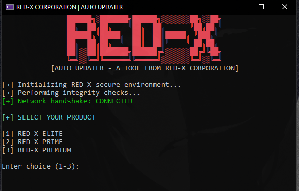

# RED-X EXE Auto-Updater

**RED-X EXE Auto-Updater** is a secure console-based updater designed to download and launch the latest versions of RED-X products directly from GitHub, including private repositories. It provides a professional experience with progress tracking, network checks, and error handling.

---

## Features

- ✅ Supports multiple products:  (for eg)
  - RED-X ELITE  
  - RED-X PRIME  
  - RED-X PREMIUM

- ✅ Download from **private GitHub repositories** using Personal Access Token (PAT)  

- ✅ Dynamic **download progress bar** with speed and ETA  

- ✅ Network handshake to verify connectivity  

- ✅ Typing effect for console messages and centered ASCII banner  

- ✅ Automatic launch of downloaded executable  

---

## Requirements

- .NET Framework 4.7.2 or later / .NET 6+  
- Internet access  
- GitHub Personal Access Token (PAT) with **repo access** for private repositories  

---

## Usage

1. Clone or download the repository.
2. Open the project in Visual Studio.
3. Replace the `githubPAT` variable in `Program.cs` with your own Personal Access Token.
4. Build the project.
5. Run the updater EXE:
   - Select your product (1-3) from the menu.
   - The updater will download the latest EXE and launch it automatically.

---

## Security Note

- Keep your **Personal Access Token (PAT)** secure. Avoid committing it directly to public repositories.  
- For private repo access, ensure your token has the **`repo`** scope or fine-grained read access.

---

## 🏆 Credits

- 💻 Fully developed by **Mohtasim Billah Jitu**
- ❤️ If you share or use this project, please give proper credit.

---

## 🌐 Connect With Us

- **Discord:** [Join the RED-X Server](https://discord.gg/f7KPc9JyeY)  
- **Telegram:** [Follow our Channel](https://t.me/+OglBPVcrngY1OGQ9)  
- **Instagram:** @mohtasimjitu  

Built with ❤️ by **RED-X CORPORATION**  
© 2025 RED-X CORPORATION. All rights reserved.
## License

---

This project is **proprietary** to RED-X CORPORATION. All rights reserved. Unauthorized distribution is prohibited.
